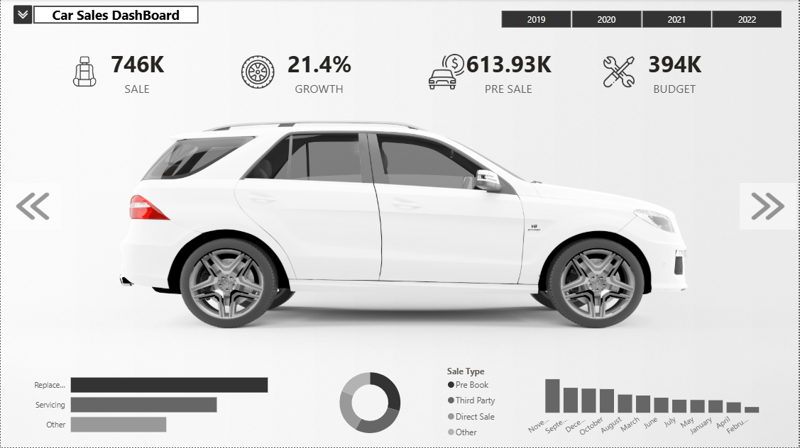
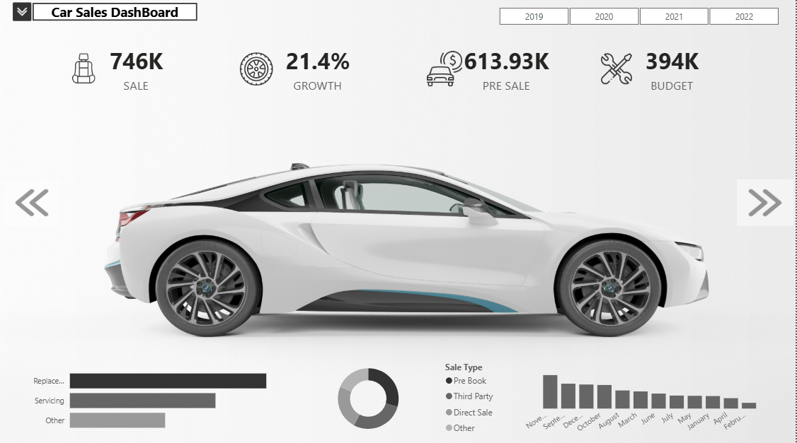
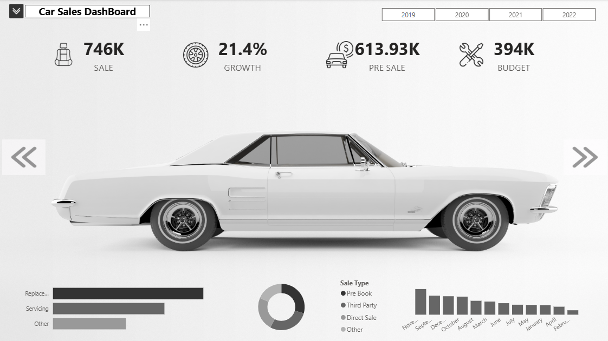
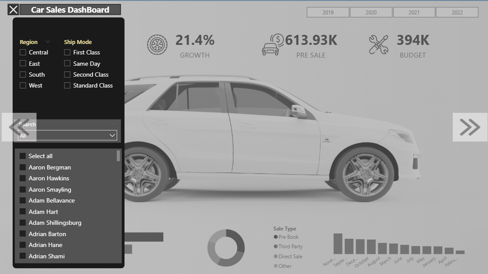

# 🚗 Car Sales Dashboard - Power BI

---

## Business Problem

Sales managers require timely and accurate insights to monitor sales performance, evaluate business growth, compare actual sales with budgets, and identify sales trends across different years. Traditional reports often make it difficult to analyze these metrics efficiently.

This interactive Power BI dashboard transforms raw sales data into meaningful visualizations that support data-driven business decisions.

---

## Overview

The **Car Sales Dashboard** is an interactive Power BI solution developed to analyze sales performance, business growth, budget utilization, and customer purchasing trends.

The dashboard enables users to explore sales data through dynamic filters and interactive visualizations, helping stakeholders monitor key performance indicators and identify business opportunities.

---

## Dashboard Preview

<!-- Replace these image names with your uploaded screenshots -->

---

## Dashboard Features

- Executive sales KPI overview
- Sales performance monitoring
- Growth analysis
- Budget vs. Sales comparison
- Pre-sale analysis
- Interactive year selection
- Dynamic filter panel
- Sales type distribution
- Monthly sales trend analysis
- Service category analysis
- Interactive navigation between dashboard pages

---

## Key Performance Indicators (KPIs)

The dashboard tracks important business metrics, including:

- Total Sales
- Sales Growth (%)
- Pre-Sales
- Budget
- Monthly Sales Trend
- Sales Type Distribution
- Service Category Performance

---

## Key Insights

- Monitor overall sales performance using executive KPI cards.
- Compare yearly sales trends to evaluate business growth.
- Analyze budget performance against actual sales.
- Identify the most common sales types.
- Evaluate monthly sales performance to detect seasonal trends.
- Understand service category distribution to support operational planning.
- Use interactive filters to analyze sales across different years and business dimensions.

---

## Tools & Technologies

- Microsoft Power BI
- Power Query
- DAX (Data Analysis Expressions)
- Data Modeling
- Data Visualization

---

## Skills Demonstrated

- Data Cleaning
- Data Transformation
- Data Modeling
- DAX Calculations
- KPI Development
- Interactive Dashboard Design
- Business Intelligence
- Sales Analytics
- Data Visualization

## How to Use

1. Download the repository.
2. Open `Car_Sales_Dashboard.pbix` using Microsoft Power BI Desktop.
3. Refresh the data if required.
4. Use the filters and navigation buttons to explore different sales insights.

---

## Future Enhancements

Potential improvements include:

- Regional sales analysis
- Customer segmentation
- Salesperson performance dashboard
- Product profitability analysis
- Forecasting future sales using Power BI forecasting
- Drill-through pages for detailed analysis

---

## Contact

**GitHub**

https://github.com/meskerem-meheret

**LinkedIn**

*(Add your LinkedIn profile URL here.)*

---

⭐ If you found this project interesting, feel free to star the repository.
